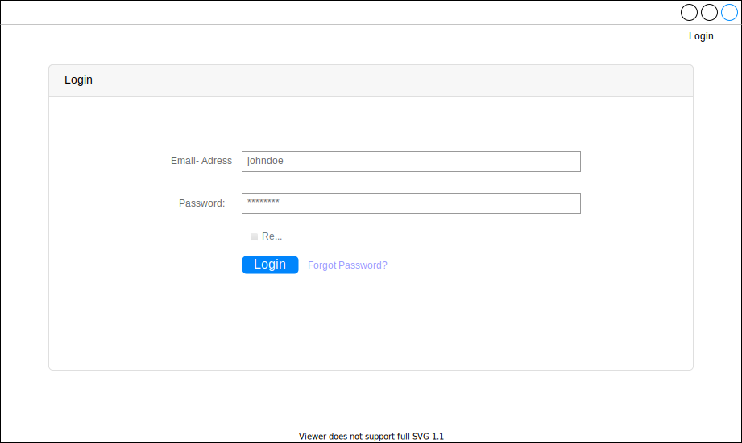
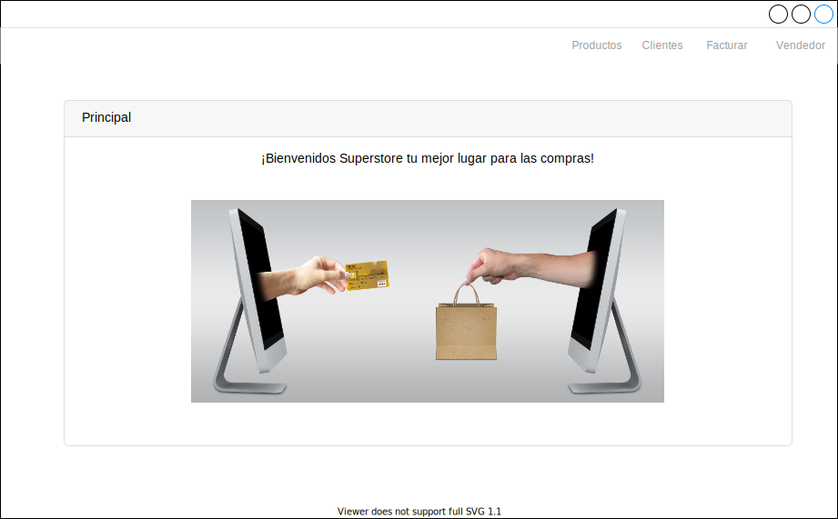
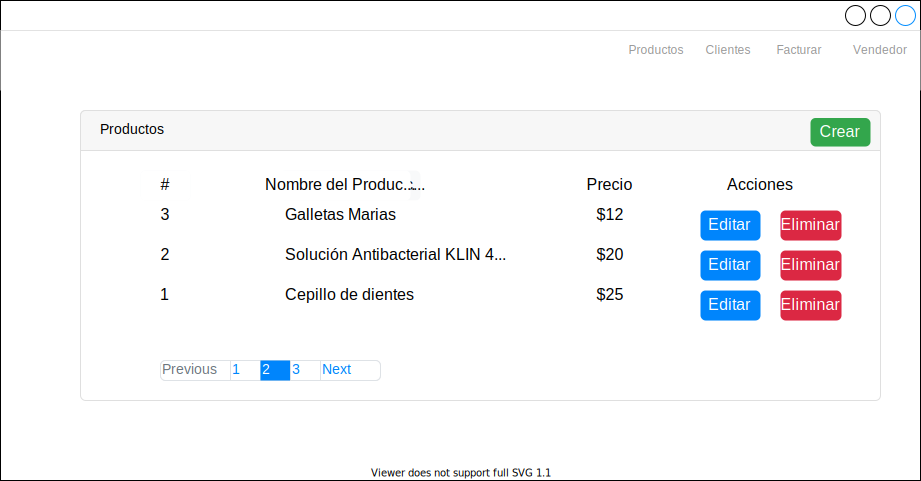
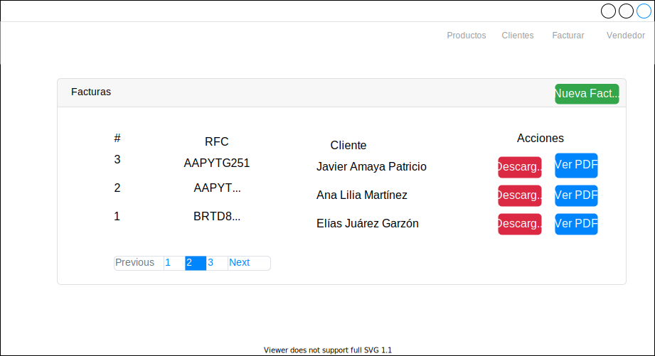
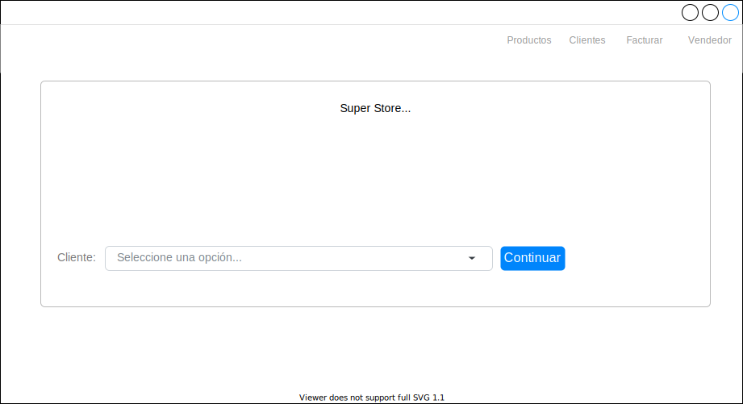
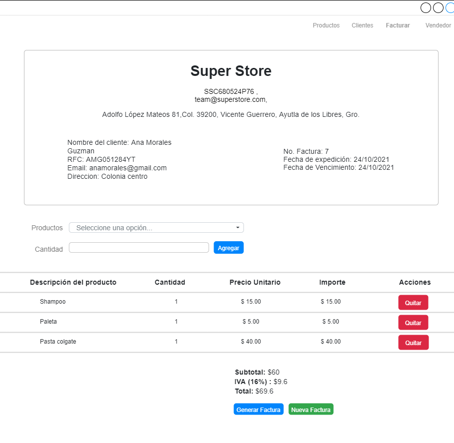

# 📑 Invoice Generator

This is an invoicing system created with Laravel, which allows the user to generate invoices based on product and customer catalogs that are manageable.

You can see it here → [Invoice-Generator.](http://afternoon-scrubland-44856.herokuapp.com/ "Invoice-Generator.")
Credentials
- email: vendedor@superstore.com
- password: 12345

## 🛠️ Previous configuration

###  Creation of the .env file for environment variable configuration
1. Go to root folder and create an .env file.
2. Open the .env.example file and copy all of its contents.
3. Go to your .env file and paste the copied content.

### Database access configuration using the .env file
1. You must enter the .env file and configure the database section with the following fields.
```
DB_CONNECTION=mysql
DB_HOST=127.0.0.1
DB_PORT=3306
DB_DATABASE=invoicing_system
DB_USERNAME=root
DB_PASSWORD=
```

## 🚀Available commands
Installation of application dependencies
```
composer install
```

Generating the APP_KEY property of our Laravel project in the .env file
```
php artisan key:generate
```

Execution of the migrations to create the database tables.
```
php artisan migrate
```

Insertion of data from the user table
```
php artisan db:seed
```

Insertion of data in the client table
```
php artisan db:seed --class=ClientSeeder
```

Insertion of data in the products table
```
php artisan db:seed --class=ProductSeeder
```

Inserting data from our companies table
```
php artisan db:seed --class=CompanySeeder
```

Runs the app in the development mode.
```
php artisan serve
```

## 📊 Physical Database Model

## 🧩 Mockups
<details>
    <summary>🪧 Sketches</summary>
     
     
     
     
     
     
</details>


## 🧑‍💻Technologies
1. PHP
2. Laravel
3. Composer
4. Laravel/UI
3. DOMPDF
4. MySQL
5. Bootstrap
6. Heroku
7. Heroku CLI
